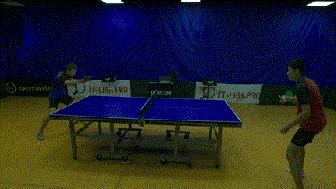
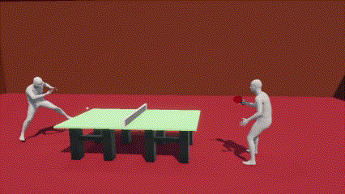
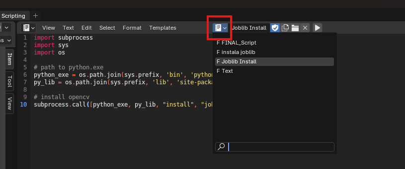
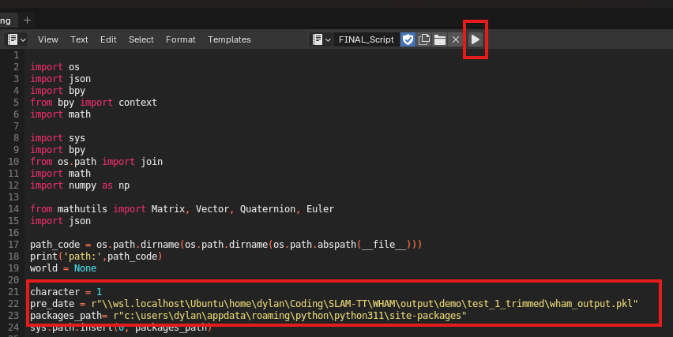
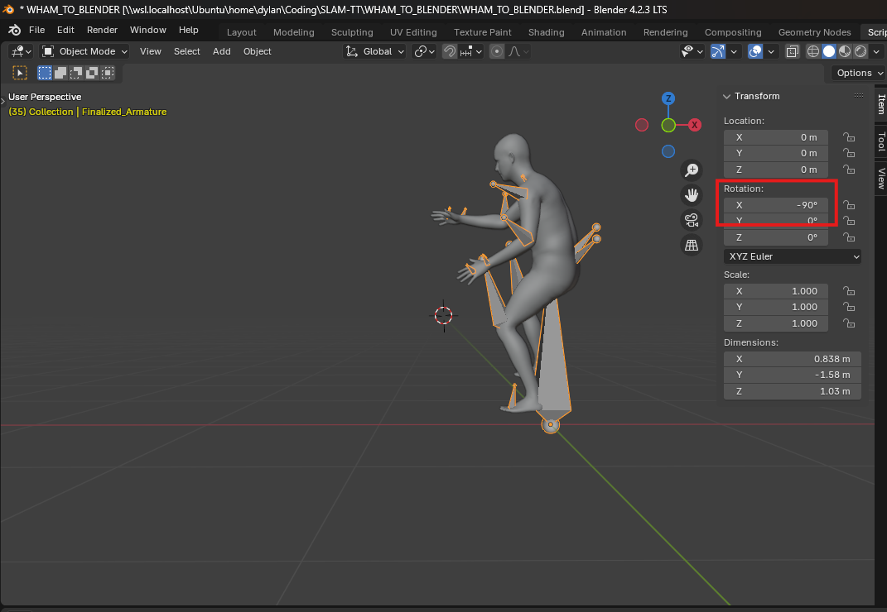
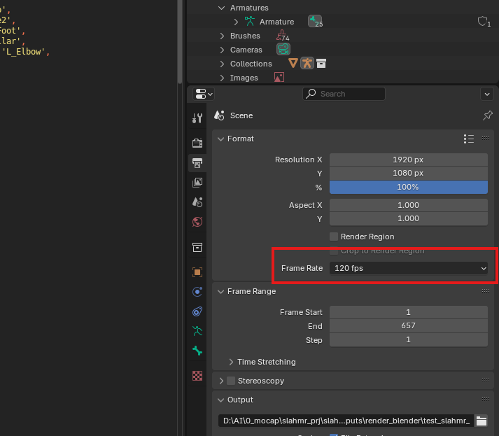
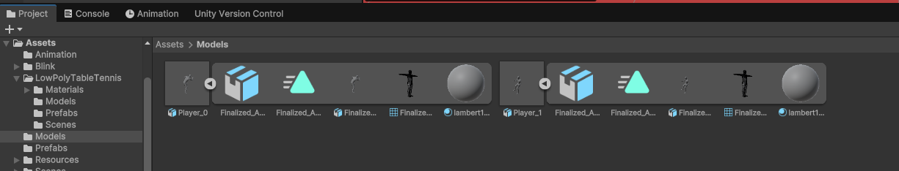
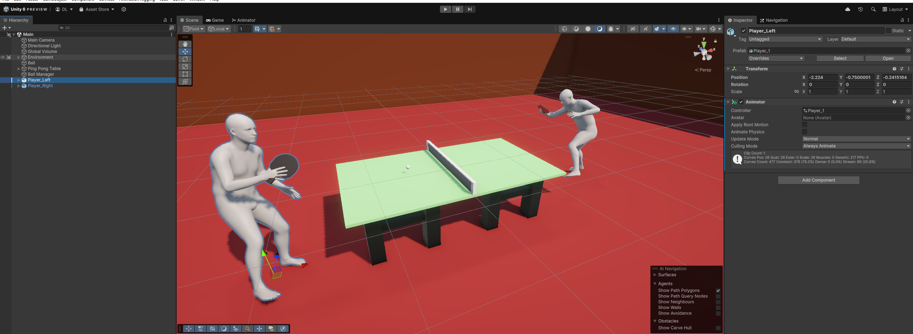
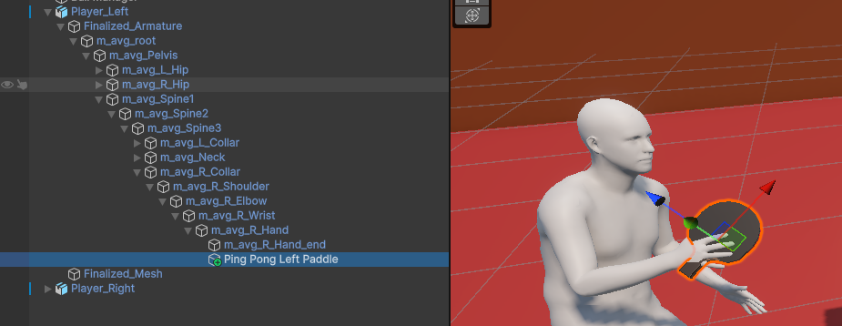
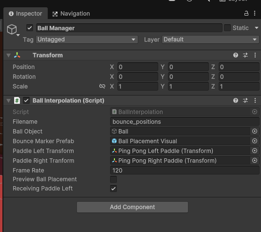

# SLAM-TT: Simultaneous Localization and Mapping for Table Tennis

Transform monocular footage of a table tennis game and transform it into a full 3D recreation. This process is done in three stages: ball/bounce detection with TTNet, 3D human poses detection with WHAM, and full scene rendering with Unity.

Original Clip|Transformed Clip
--|--
 | 

Multiple Perspectives
--


YouTube Demo
--
[](https://www.youtube.com/watch?v=F_HpfIQpiJo)

Resources
--
- TTNet Repo: https://github.com/AugustRushG/TTNet-Real-time-Analysis-System-for-Table-Tennis-Pytorch
- WHAM Repo: https://github.com/yohanshin/WHAM

---


## Setup Guide

### Prerequisites

To ensure smooth setup and functionality, make sure your system meets the following requirements:
- Operating System: Linux or Windows Subsystem for Linux (WSL)
- Graphics: Nvidia GPU with CUDA support.

### Overview

- TTNet: Used to detect ball position and bounce
- WHAM: Used to detect player movements
- WHAM_TO_BLENDER: Used to take WHAM ```.pkl``` output and export it to blender
- Unity: Used to render the entire scene

### 1. Setup


- Install [Conda](https://docs.anaconda.com/miniconda/install/#quick-command-line-install) (highly recommended)
- Install [CUDA 11.8](https://developer.nvidia.com/cuda-11-8-0-download-archive) (required for WHAM, the human pose detector)
- Install [Blender](https://www.blender.org/download/) (tested on 4.2.3 LTS)
- Install [Unity](https://unity.com/download) (tested on 6000.0.9f1 for Windows)

Clone recursively to include required submodules
```bash
git clone --recursive https://github.com/ccs-cs1l-f24/SLAM-TT.git
```

### 2. TTNet


Install Dependencies
```bash
cd TTNet

conda create -n ttnet python=3.9
conda activate ttnet

pip install -U -r requirement.txt

sudo apt-get install libturbojpeg
pip install PyTurboJPEG

# WSL Users: fix cv2.imshow()
sudo apt-get install libgl1-mesa-glx
sudo apt-get install xdg-utils
```

Download ```ttnet.pth``` from the [release tab](https://github.com/ccs-cs1l-f24/SLAM-TT/releases/tag/v1.0.0). Place the file in ```TTNet/checkpoints/ttnet.pth```


Usage
```bash
# (Optional) Test ball detection model
python src/demo.py

# Detects ball bounces and uses homography to map coordinates relative to table. Exports to TTNet/results/bounce_positions.json
python src/get_bounces.py
```

See more details [here](TTNet/README.md)

### 3. WHAM - [Installation Guide](https://github.com/yohanshin/WHAM/blob/main/docs/INSTALL.md)

Follow the steps linked above to install WHAM

Fetch dataset:
```bash
cd WHAM
bash fetch_demo_data.sh

# Dummy account for https://smpl.is.tue.mpg.de/
#     Username: the@writeme.com
#     Password: 1234567890
```

Generate 3D mesh from video
```bash
# Setup conda env in the guide linked above
conda activate wham

# Replace examples/IMG_9732.mov with the video from the previous step
python demo.py --video examples/IMG_9732.mov --visualize --save_pkl
```

### 4. WHAM TO BLENDER

Full Instructions: https://youtu.be/7heJSFGzxAI?si=8c1HD1Ux81eDpkLu&t=380
Note that I modified the script to be compatible with Blender>=4.1, so use the files I provide in this repo

```bash
# I already included necessary files, which I got here:
# Select "Download version 1.0.2 for Maya": https://smpl.is.tue.mpg.de/download.php
# Dummy account for https://smpl.is.tue.mpg.de/
#     Username: the@writeme.com
#     Password: 1234567890
```

1. Open ```WHAM_TO_BLENDER/WHAM_TO_BLENDER.blend```
2. Select ```Joblib Install``` in the script selection menu and press the Play button (Note: this will install joblib to your global pip packages, but you can mess around with it to use venv. Sorry!)



3. Select ```FINAL_Script```
4. Modify these lines:
```python
character = 0 # There are two players. Choose the index to focus on (0 or 1)
pre_date = r"\\wsl.localhost\Ubuntu\home\dylan\Coding\SLAM-TT\WHAM\output\demo\test_1_trimmed\wham_output.pkl" # Set this to your .pkl output path from the previous step
packages_path= r"c:\users\dylan\appdata\roaming\python\python311\site-packages" # Add your python packages to the path (wherever you installed joblib)
```
5. Press the Play button



6. Set the x rotation to -90deg and FPS to your video's original framerate

 

7. Export as FBX

### 4. Move Everything to Unity

1. Open ```SLAM-TT Unity``` in Unity Hub

2. Add ```.fbx``` models to ```Models``` folder



3. Place models reasonably in scene and add an ```Animator``` component. Add the corresponding animations to a ```AnimationController``` and attach it (shown in picture and demo scene)



4. Add ping pong paddle model to the players' hand. Demo model is found at ```Models/LowPolyTableTennis/Models/PingPongBat.fbx```



5. Drag both paddles to the Ball Manager's ```Ball Interpolation``` component. Set the FPS to your desired playback speed



## Final Result


